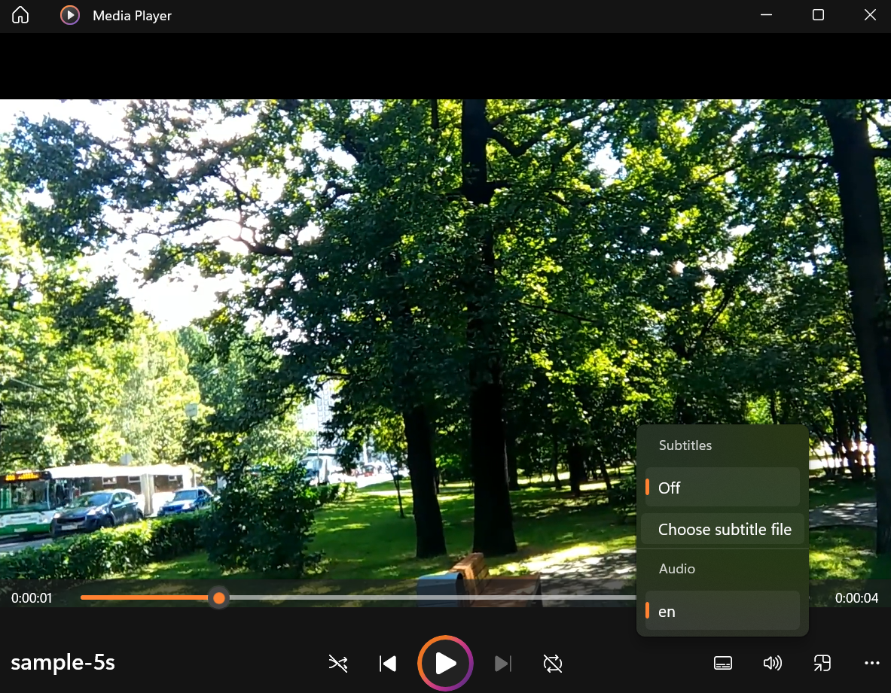

## Usage
1. `docker compose up -d`  (tested on WSL2 and latest docker desktop, earlier version of docker desktop might result in errors)
2. `docker exec -it app bash`
3. Move videos to `/movie` folder
4. Run
```bash
mkdir movie
mkdir audio
mkdir text
mkdir subtitles
```
5. Run `python videos2audio.py`, audio files will be generated in `/audio`
6. Run `python audio2text.py`, transcriptions as text will be generated in `/text`
7. Run `create_srt.py`, subtitle files will be converted from files under `/text` and saved in `/subtitles`
8. Open the video clip with and manually load the generated subtitles. The following screenshop is the Windows Media Player.



## References
- https://blog.k-bushi.com/post/tech/ai/extract-text-from-video-or-audio-with-whisper/
- https://qiita.com/TakeMimi/items/53a147270c9b6570c152
